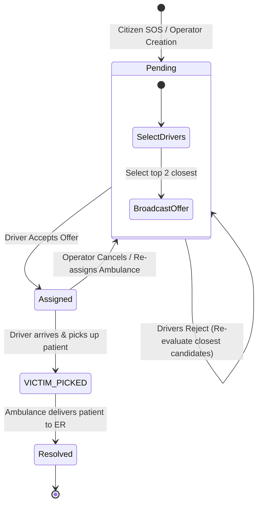

# Smart Ambulance Tracking & Dispatch System - PRD & TRD Specifications

This document serves as the combined **Product Requirements Document (PRD)** and **Technical Requirements Document (TRD)** for the **Smart Ambulance Tracking & Dispatch System**. It provides a comprehensive explanation of the system's objectives, user personas, technology stack, dispatch logics, database operations, and end-to-end workflows.

---

## Part 1: Product Requirements Document (PRD)

### 1. Project Objective & Vision
The **Smart Ambulance Tracking & Dispatch Prototype** is an interactive, real-time crisis management ecosystem. The goal is to simulate a production-grade emergency medical services (EMS) dispatch center to demonstrate:
* Real-time GPS ambulance fleet tracking.
* Automated smart dispatching based on geography and availability.
* Inter-departmental coordination (Control Room Operators, ER Staff, Police, and Drivers).
* Citizen SOS reporting with media verification.

### 2. Target Users & Personas
1. **Emergency Control Room Operator (Dispatcher)**:
   * *Role*: Monitor active ambulances and incidents across India, trigger manual overrides, register new assets on the fly.
2. **Police Command Officer (Law Enforcement)**:
   * *Role*: Monitor active incident logs, acknowledge notifications to signal police presence at the scene, and coordinate field operations.
3. **Hospital ER Coordinator (Medical Staff)**:
   * *Role*: Manage hospital capacities (ICU beds, ventilators, specialists) and accept/reject incoming emergency transports based on live ETAs.
4. **Ambulance Driver (First Responder)**:
   * *Role*: Receive emergency notifications, route to the scene, record patient pickup, and safely transport the victim to the ER.
5. **Reporting Citizen**:
   * *Role*: File instant emergency requests with photos/audio logs and monitor responder ETA.

### 3. Key Functional Requirements
* **SOS Incident Reporting**: Geolocation-based incident creation with media uploads (photos, audio, video).
* **Automatic Dual-Driver Proximity Dispatching**: The system searches for and broadcasts offers to the **top 2 closest available drivers** simultaneously.
* **First-Come, First-Served Reservation**: The first driver to click "Accept" secures the assignment, locking the emergency. The offer screen is instantly cleared on the losing driver's app.
* **Unified Police Presence Warning**: Police can mark an incident as seen, instantly propagating alert states to all dashboards and drivers.
* **Hospital Resource Management**: Real-time capability synchronization that guides dispatcher decisions.
* ** Fleet Tracking**: Duplex GPS coordinate streaming for live map rendering.

---

## Part 2: Technical Requirements Document (TRD)

### 1. Technology Stack

```
+-----------------------------------------------------------------------------------+
|                                  CLIENT LAYER                                     |
|                                                                                   |
|  [ Control Room ]         [ Hospital Dashboard ]        [ Police Dashboard ]      |
|  React/Vite + Tailwind    React/Vite + CSS Light        React/Vite + CSS Dark     |
|                                                                                   |
|                   [ Citizen App ]            [ Driver App ]                       |
|                   React Native (Expo)        React Native (Expo APK)              |
+-----------------------------------------------------------------------------------+
                                         |
                                         | REST APIs & Sockets (JSON over TCP)
                                         v
+-----------------------------------------------------------------------------------+
|                                 BACKEND LAYER                                     |
|                                                                                   |
|  [ Express.js REST API ]    [ Socket.IO Real-time Server ]   [ Dispatch Engine ]  |
|  Node.js (on Render)        Duplex WebSockets Rooms          Proximity & Locks    |
|                                                                                   |
|                          [ In-Memory dbCache Store ]                              |
|                          Synchronous Cache-Aside Wrapper                          |
+-----------------------------------------------------------------------------------+
                                         |
                                         | Asynchronous Background Operations
                                         v
+-----------------------------------------------------------------------------------+
|                               STORAGE & INFRASTRUCTURE                            |
|                                                                                   |
|     [ Supabase PostgreSQL ]                    [ Cloudinary Media CDN ]           |
|     Cloud SQL DB Sync                          Citizen Attachments                |
+-----------------------------------------------------------------------------------+
```

* **Core Backend Runtime**: Node.js + Express.js API server (hosted on Render).
* **Real-time Event Broker**: Socket.IO for duplex WebSocket transport.
* **Database & Auth Services**: Supabase PostgreSQL database.
* **Storage CDN**: Cloudinary for citizen-reported media attachments.
* **Vite-React Client Dashboards**:
  * **Operator (Vercel)**: React 18, Tailwind CSS, Leaflet Map Core.
  * **Hospital (Vercel)**: React 18, Light Mode Custom CSS.
  * **Police (Vercel)**: React 18, Dark Mode Custom CSS.
* **Mobile Framework**: React Native + Expo (compiled to APK via EAS Build).

---

## 2. Core Business Logics & Algorithms

### 2.1 The Proximity Allocation Algorithm (Haversine Formula)
To locate the closest available responders to an incident, the dispatch engine calculates the great-circle distance between two points on a sphere using their latitudes and longitudes:

$$d = 2R \arcsin\left(\sqrt{\sin^2\left(\frac{\Delta \text{lat}}{2}\right) + \cos(\text{lat}_1) \cos(\text{lat}_2) \sin^2\left(\frac{\Delta \text{lon}}{2}\right)}\right)$$

* Where $R$ is the Earth's radius (6371 km).
* Latitudes and longitudes are converted from degrees to radians.

**Haversine Implementation in Code (`backend/services/dispatchEngine.js`)**:
```javascript
function calculateDistance(lat1, lon1, lat2, lon2) {
  const R = 6371; // Earth's radius in km
  const dLat = (lat2 - lat1) * Math.PI / 180;
  const dLon = (lon2 - lon1) * Math.PI / 180;
  const a = 
    Math.sin(dLat/2) * Math.sin(dLat/2) +
    Math.cos(lat1 * Math.PI / 180) * Math.cos(lat2 * Math.PI / 180) * 
    Math.sin(dLon/2) * Math.sin(dLon/2);
  const c = 2 * Math.atan2(Math.sqrt(a), Math.sqrt(1-a));
  return R * c; // Distance in km
}
```

---

### 2.2 Dual-Driver Concurrent Offer Dispatch Logic
Unlike standard dispatch systems that query and offer assignments to only a single driver at a time, this system runs a concurrent dual-driver allocation protocol:
1. **Query**: The dispatch engine sorts all ambulances with status `Available` by their distance from the incident.
2. **Slice**: It slices the top **2 closest available ambulances**.
3. **Targeted Broadcast**: The backend individually targets the registered socket rooms of both drivers (`ambulance:id`) and emits `dispatch:offer`.
4. **First-Come, First-Served Lock (`backend/controllers/dispatchController.js`)**:
   * The first driver who Accepts sends an `acceptOffer` socket call.
   * **Locking**: The backend verifies if the driver is in the offered list and if the emergency status is still `Pending`.
   * **Transition**: Emergency transitions to `Assigned` (locking it from further modifications) and the accepting ambulance status is updated to `Busy`.
   * **Exhaustion**: The backend instantly emits `dispatch:offer:exhausted` to the second candidate, automatically removing the popup panel from their device.
5. **Failover Rejection**:
   * If a driver clicks **Reject**, the system adds their ID to the `rejected_by` array and immediately searches for the next nearest available ambulance to fill the vacant offer slot.

---

### 2.3 Cache-Aside Database Strategy
To support real-time map pings and sub-second UI updates, the backend sits on top of a **synchronous local memory cache** (`dbCache` in `backend/database/db.js`):
1. **Boot**: The system reads all tables from Supabase PostgreSQL and hydrates `dbCache`.
2. **Query Requests**: Handled instantly by reading the cache synchronously.
3. **Database Writes (Insert/Update)**:
   * Instantly updates the in-memory cache.
   * Background process triggers asynchronous writes to Supabase.
   * Omit temporary runtime metadata (e.g. `offered_to`, `rejected_by`) before cloud database syncs to prevent database schema errors.

---

### 2.4 Incident State Machine



* **Pending**: SOS created, dispatch engine calculates closest available fleet and broadcasts offers.
* **Assigned**: One driver has accepted. The ambulance moves to the scene.
* **VICTIM_PICKED**: Driver has secured the patient. The vehicle is rerouted to the hospital.
* **Resolved**: Patient delivered. Ambulance goes back to `Available` status.

---

## Part 3: End-to-End System Walkthrough (Workflow)

```
[ Citizen ]        [ Cloudinary ]        [ Backend Server ]        [ Police/Hospital ]        [ Driver ]
    |                    |                       |                          |                      |
    |-- Upload Image --->|                       |                          |                      |
    |<-- Return CDN URL -|                       |                          |                      |
    |                                            |                          |                      |
    |-- Send SOS (HTTP POST) ------------------->|                          |                      |
    |                                            |-- Calculate Proximity    |                      |
    |                                            |   (Select top 2)         |                      |
    |                                            |                          |                      |
    |                                            |-- dispatch:offer ------->|                      |---> [Driver 1 & 2 Alerted]
    |                                            |   (WS Broadcast)         |                      |
    |                                            |                          |                      |<--- Accept (Driver 1)
    |                                            |-- locks emergency        |                      |
    |                                            |-- dispatch:assigned ---->|                      |---> [Driver 2 popup cleared]
    |                                            |   (WS Broadcast)         |                      |
    |                                            |                          |                      |
    |                                            |<-- emergency:police-seen |                      |---> [Police click "Mark Seen"]
    |                                            |   (WS Broadcast)         |                      |
    |                                            |-- police_seen = true --->|                      |---> [All screens render badge]
    |                                            |                          |                      |
    |                                            |<-- victimPickedUp -------|                      |---> [Driver arrives at scene]
    |                                            |   (WS Broadcast)         |                      |
    |                                            |-- status: VICTIM_PICKED -|                      |---> [Reroute map to Hospital]
    |                                            |                          |                      |
    |                                            |<-- resolved -------------|                      |---> [Patient delivered to ER]
    |                                            |   (WS Broadcast)         |                      |
    |                                            |-- status: Resolved ------>|                      |---> [Ambulance: Available]
```

### 1. Phase 1: Incident Reporting
1. A citizen opens the **Citizen SOS App**, captures a photo of an accident scene, and taps SOS.
2. The app uploads the photo to **Cloudinary** and receives a public CDN image URL.
3. The app issues an HTTP `POST` to `/api/emergencies` with GPS coordinates, description, and the Cloudinary media link.

### 2. Phase 2: Concurrent Allocation
1. The backend receives the emergency, registers it as `Pending` in `dbCache`, and launches the dispatch logic.
2. The engine calculates proximity to available ambulances via the Haversine formula and selects the two closest candidates.
3. The Socket server targets both candidates and emits `dispatch:offer`. Both drivers see a fullscreen alert with the incident details and photo.

### 3. Phase 3: Acceptance & Socket Locks
1. **Driver 1** accepts the offer first. Their app emits `acceptOffer` over WebSockets.
2. The backend validates the lock: transitions the emergency status to `Assigned` and locks it, sets the ambulance status to `Busy`, and allocates the ER hospital.
3. The backend sends `dispatch:offer:exhausted` to **Driver 2**'s room, clearing their screen.
4. The system broadcasts `emergencies:list` and `ambulances:list` to all dashboards to update the maps.

### 4. Phase 4: Police Security Presence
1. The police officer views the incident logs on the **Police Dashboard** and clicks **Mark As Seen**.
2. The dashboard emits `emergency:police-seen` socket event.
3. The backend sets `police_seen = true` in cache and databases, and broadcasts `emergency:updated`.
4. **Instant UI Updates**:
   * **Control Room**: Shows a `👮 Police Alerted` badge on the active panel.
   * **Hospital**: Shows a `👮 Police Active` label next to the alert card.
   * **Driver App**: Renders a warning alert banner on the navigation screen.

### 5. Phase 5: Patient Pickup & Resolution
1. **Driver 1** arrives at the scene and clicks **Patient Picked Up**. The app emits `victimPickedUp`.
2. The backend transitions the emergency status to `VICTIM_PICKED` and broadcasts updates. The driver's map switches routes to direct them to the hospital.
3. **Driver 1** arrives at the ER and clicks **Deliver Case / Resolved**. The app emits `resolved`.
4. The backend marks the emergency `Resolved` and sets the ambulance status back to `Available`, making it ready for the next dispatch.
5. All dashboard interfaces clear the incident from active lists.
