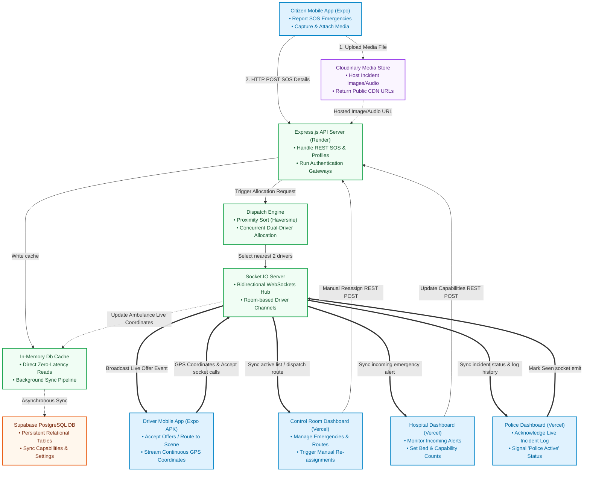

# Smart Ambulance Tracking & Dispatch System - System Architecture

This document describes the complete system architecture, data flows, communication protocols, and infrastructure integrations of the **Smart Ambulance Tracking & Dispatch Prototype**.

---

## 1. System Architecture Diagram

The system follows a modern **Duplex Real-Time Event-Driven Client-Server Architecture** with a synchronous in-memory cache-aside store overlaying a persistent cloud database.



---

## 2. Component Directory Breakdown

### 2.1 The 3 Front-End Dashboards
* **Control Room Operator Dashboard (`/frontend`)**: 
  * Built using **React + Vite + Tailwind CSS (Light Theme)**.
  * Used by operators to manage live emergencies, visualize active ambulance routes on Leaflet maps in real-time, trigger manual dispatch overrides, and monitor system KPIs.
* **Police Workstation Dashboard (`/police-dashboard`)**:
  * Built using **React + Vite + Custom CSS (Dark Cyberpunk Theme)**.
  * Used by law enforcement units to monitor live incident logs. It features a critical **"Mark as Seen"** action button, which updates all dispatch systems that police are alert and active at the scene.
* **Hospital capabilities Dashboard (`/hospital-dashboard`)**:
  * Built using **React + Vite + Custom CSS (Light Theme)**.
  * Used by hospital staff to monitor incoming patient alerts, accept or reject incoming emergency cases, edit ICU beds/ventilators/emergency capabilities, and view routes of ambulances heading towards them.

### 2.2 The 2 Mobile Applications
* **Citizen SOS Reporter App (`/citizen-app`)**:
  * Built using **React Native + Expo**.
  * Allows citizens to report emergencies instantly on a map, upload media attachments (photos, videos, or audio recordings), and monitor the ETA of dispatched responders.
* **Ambulance Driver App (`/driver-app`)**:
  * Built using **React Native + Expo**.
  * Used by ambulance drivers to receive simultaneous concurrent dispatch offers (first-come, first-served locks), report live GPS updates via Background Geolocation, view routing navigation to the scene and hospital, and trigger patient pickup and delivery completions.

### 2.3 The Backend API Server (`/backend`)
* Built using **Node.js + Express.js + Socket.IO**.
* Implements a **Cache-Aside Architecture** (`backend/database/db.js`):
  * On server boot, data is hydrated from Supabase PostgreSQL tables into local memory cache (`dbCache`).
  * Read operations (such as fetching coordinates or status lists) query the synchronous in-memory cache directly, ensuring zero-latency responses for real-time tracking loops.
  * Write operations (such as creating emergencies or moving ambulances) update the local memory cache instantly and run asynchronous write-through processes to Supabase in the background, preventing network blockers.

### 2.4 Cloud Media Storage
* **Cloudinary**: Holds all media content uploaded by citizens (photos of crash scenes, voice reports, videos). The Citizen app uploads files directly to Cloudinary and passes the resulting CDN URLs to the backend API during incident registration.

---

## 3. Real-Time Communication Protocol & WebSockets

The system uses **Socket.IO** for instantaneous bidirectional updates across all client terminals.

### 3.1 Primary Socket Event Flow

```
[ CitizenSOS ]              [ Backend Socket.IO ]              [ Driver App ]
      |                              |                                |
      |-- HTTP POST Emergency ------>|                                |
      |                              |-- Proximity Projections        |
      |                              |   & Select 2 Drivers           |
      |                              |                                |
      |                              |-- socket.emit(dispatch:offer) >| (Alert Popup)
      |                              |   (Sent to both driver rooms)  |
      |                              |<-- socket.emit(acceptOffer) ---| (Driver accepts)
      |                              |                                |
      |                              |-- socket.emit(assigned) ------>| (Locks assignment)
      |                              |-- socket.emit(offer:exhausted) | (Closes losing driver popup)
      |                              |                                |
      |<-- Broadcast list updates ---|-- Broadcast status changes --->| (Dashboards & Map sync)
```

### 3.2 WebSocket Events Dictionary

| Event Name | Sender | Receiver | Description |
| :--- | :--- | :--- | :--- |
| `driver:register` | Driver App | Backend | Registers socket session inside target room `ambulance:id` to receive direct offers. |
| `dispatch:offer` | Backend | Driver App | Broadcasts dispatch opportunity to the top 2 closest drivers. |
| `dispatch:assigned` | Backend | All Dashboards | Broadcasts that a driver accepted the offer and is en route. |
| `dispatch:offer:exhausted` | Backend | Driver App | Dispatched to the "losing" candidate driver to clear their alert screen. |
| `emergency:police-seen` | Police Dashboard | Backend | Signals that police acknowledged the emergency. Updates database column. |
| `emergency:updated` | Backend | All Dashboards | Transmits live status modifications (e.g. Police alerted, ambulance en route). |
| `emergencies:list` | Backend | All Dashboards | Broadcasts complete re-sync of active incident tables. |
| `ambulances:list` | Backend | All Dashboards | Broadcasts live coordinate pings of active vehicles on map layers. |

---

## 4. Key Core Workflows

### 4.1 Proximity Dispatching Flow (Dual-Offer Logic)
1. An emergency is reported at coordinates `(lat, lon)`.
2. The Backend Dispatch Engine calculates distances to all ambulances with `status = 'Available'` using the **Haversine formula**.
3. The engine sorts the candidates and fetches the **top 2 closest ambulances**.
4. Both candidates are registered in the emergency's `offered_to` list.
5. The backend emits `dispatch:offer` to both drivers simultaneously.
6. The first driver to accept calls `acceptOffer`:
   * The emergency status transitions to `Assigned` (locks the ticket).
   * The accepting ambulance status transitions to `Busy`.
   * Backend emits `dispatch:offer:exhausted` to the second driver, clearing their screen.
7. If both drivers reject, the engine automatically calculates the next nearest candidate to fill the vacant slot.

### 4.2 Police Acknowledgment Propagation
1. Police officer views an incident on `/police-dashboard` and clicks **Mark As Seen**.
2. The Police Dashboard emits `emergency:police-seen` socket event with the incident ID.
3. The Backend updates the database (`police_seen = true`) and broadcasts `emergency:updated` to all connected clients.
4. **Dashboards sync**:
   * Control Room shows a `👮 Police Alerted` badge.
   * Hospital Dashboard displays a `👮 Police Active` overlay tag.
   * The Driver App map view renders a warning alert banner: `👮 Police Alert: Police are informed and in action at the scene.`
